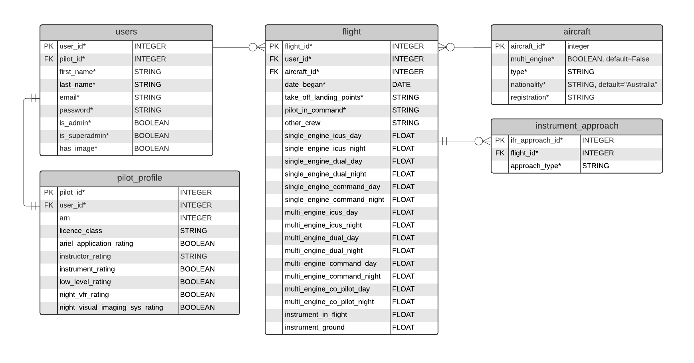

# Pilot Logbook

I am creating a Pilot Logbook for recording flights. Pilots will be able to create an account, log in, add their personal and licencing information and a profile photo. They will then be able to start recording flights, and view a table of their past flights and their total flight hours.



## Data validation

All of the ```STRING``` fields will have character limits. Within the ```pilot_profile``` table, the ```licence_class``` and ```instructor_rating``` fields will be subject to data validation, as there are only a finite number of options for each.

### licence_class
* RPL (Recreational pilot licence)
* PPL (Private pilot licence)
* CPL (Commercial pilot licence)
* ATLP (Air transport pilot licence)[^1]

### instructor_rating
* Grade 1
* Grade 2
* Grade 3

Within the ```flight``` table, the ```date_began``` field cannot be after today's date, and all of the ```FLOAT``` fields must be a number less than 24. The longest commerical flight in the world right now is under 19 hours[^2], and wouldn't have much fuel left to fly longer, so 24 hours would be more than sufficient. Most aircraft capable of mid-flight refuelling are operated by military personnel, who would be subject to different regulations than those covered here. The customer pool of AirForce One pilots who have remain airborne for a week is small, so I won't be taking them into account.

Within the instrument_approach table, ```approach_type``` will be data validated to one of the following: 
* ILS (instrument landing system)
* RNP (reduced navigation performance)
* VOR (variable omni-directional range)
* NDB (non-directional beacon)
* Visual

## Security

User privacy will be protected with an authorisation system, implemented using the ```Flask-Login``` package in the ```main.py``` file, where the app is created, and the ```users``` model. The ```users``` model will not actually store the password, but a hash of the password. I will add a secret key to the ```.env``` file, which is listed in the ```.gitignore``` file, to prevent its public display. Finally, the ```UserSchema``` model in the ```user_schema``` file will include a password that, rather than getting its value straight from the dictionary, uses a function that validates the password and hashes it. The validation checker will ensure the password:
* is between 8 and 30 characters long
* contains at least one digit
* contains at least one uppercase letter
* contains at least one lowercase letter
* contains at least one symbol
* does not contain "password" or "passw0rd" ಠ_ಠ

As an alternative, I could opt to import the ```regex``` package[^3]. Once a user is authenticated, they will only be able to view and edit their own profile and flight logs.

When writing the database queries, I will not be writing my own raw SQL, which would be vulnerable to SQL injection attacks. I will instead utilise an ORM, Object Relational Mapper, SQLAlchemy. Instead of passing user inputs directly to the database as a query, this software uses a ```BindParameter``` to wrap a ```%``` around the inputs and assigns them to variables. Any values that had been in the original input that would have executed an SQL command are escaped[^4], and the input is now a harmless string, preventing a Little Bobby Tables[^5] situation.

## Obligations

Many of the fields in the diagram above are included in order to comply with Civil Aviation Safety Regulations (CASR))[^6]. According to CASR 1998 - REG 61.345:
> A person who holds a pilot licence ... commits an offence if the person does not keep a personal logbook in accordance with this regulation.

It then goes on to stipulate the required fields for a flight to be logged. Civil Aviation Safety Authority (CASA) regularly conduct logbook audits, and can demand a pilot produce their logbook at any time. The pilot must comply within 7 days. Failure to do so could result in CASA issuing the pilot with 50 penalty units[^7], which would currently equate to $11,100[^8].

As well as this threat of financial penalty, the accuracy of a pilot's logbook could also affect their employment. It is also important to consider that regulations change. In fact, at the time of writing this document, the regulations are changing, and many of the CASA website pages are presenting an error ```404```, which has not made things easy. It would be incumbent on the developer to remain abreast of any changes to ensure the logbook's continued compliance.

## References

[^1]: “Pilot Licences.” Civil Aviation Safety Authority, www.casa.gov.au/licences-and-certificates/pilots/pilot-licences. Accessed 10 Dec. 2021.
[^2]: Chui, Sam. “The 10 Longest Non-Stop Flights in the World in 2021.” SamChui.Com, 1 Nov. 2021, samchui.com/2021/10/28/2021-top-10-worlds-longest-flights.
[^3]: Dushyant Pathak. “Password Validation in Python.” GeeksforGeeks, 29 Dec. 2020, www.geeksforgeeks.org/password-validation-in-python.
[^4]: “Column Elements and Expressions — SQLAlchemy 1.4 Documentation.” SQLAlchemy, docs.sqlalchemy.org/en/14/core/sqlelement.html#sqlalchemy.sql.expression.bindparam. Accessed 10 Dec. 2021.
[^5]: “Exploits of a Mom.” Xkcd, xkcd.com/327. Accessed 10 Dec. 2021.
[^6]: “Civil Aviation Safety Regulations 1998.” Federal Register of Legislation, 28 July 2021, www.legislation.gov.au/Details/F2021C00896/Html/Volume_2#_Toc81485779.
[^7]: “CIVIL AVIATION SAFETY REGULATIONS 1998 - REG 61.345 Personal Logbooks--Pilots.” Commonwealth Consolidated Regulations, 1998, classic.austlii.edu.au/au/legis/cth/consol_reg/casr1998333/s61.345.html.
[^8]: Porter, Christian. “Notice of Indexation of the Penalty Unit Amount.” Federal Register of Legislation, 14 May 2020, www.legislation.gov.au/Details/F2020N00061.
