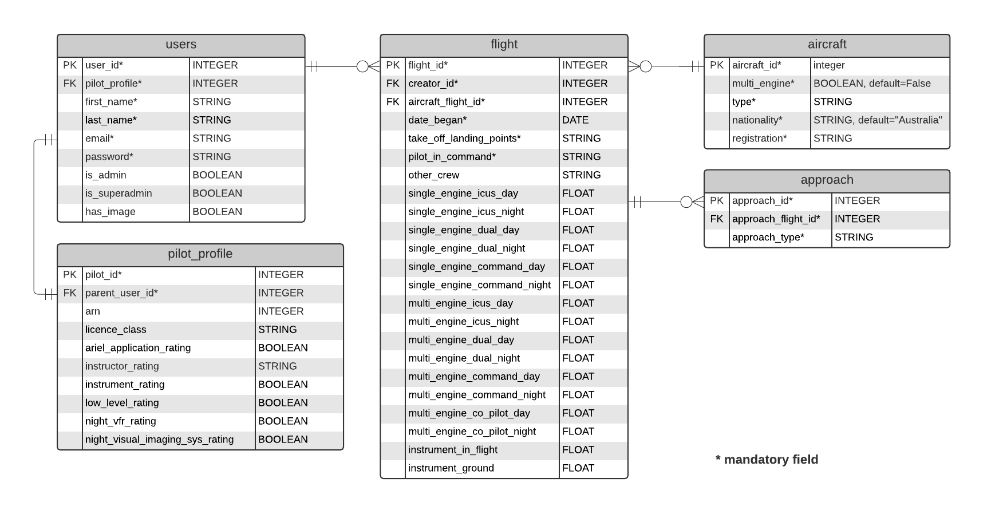

# Pilot Logbook

I am creating a Pilot Logbook for recording flights. Pilots will be able to create an account, log in, add their personal and licencing information and a profile photo. They will then be able to start recording flights, and view a table of their past flights and their total flight hours.



## Data validation


All of the ```STRING``` fields will have character limits. Within the ```pilot_profile``` table, the ```licence_class``` and various ```instructor_rating``` fields will all be subject to data validation, as there are only a finite number of options for each.

### licence_class
(https://www.casa.gov.au/licences-and-certificates/pilots/pilot-licences)
* RPL (Recreational pilot licence)
* PPL (Private pilot licence)
* CPL (Commercial pilot licence)
* ATLP (Air transport pilot licence)

### instructor_rating
* Grade 1
* Grade 2
* Grade 3

Within the ```flight``` table, the ```date_began``` field cannot be after today's date, and all of the ```FLOAT``` fields must be a number less than 24.

Within the instrument_approach table, ```approach_type``` will have to be one of the following: 
* ILS (instrument landing system)
* RNP (reduced navigation performance)
* VOR (variable omni-directional range)
* NDB (non-directional beacon)
* Visual

## Security

xxxxxxxxxxxxxxxxxxxxxxxxxxxxxxxxxxxxxxxxxxxxxxxxxxxxxxxxxxxxxxxxxxxxxxxxxxxxxxxxxxxxxxxxxxxxxxxxxxxxxxxxxxxxxxxxxxxxxxxxxxxxxxxxxxxxxxxxxxxxxxxxxxxxxxxxxxxxxxxxxxxxxxxxxxxxxxxxxxxxxxxxxxxxxxxx

## Obligations

Many of the fields in the diagram above are included in order to comply with CASR (Civil Aviation Safety Regulations). (https://www.legislation.gov.au/Details/F2021C00896/Html/Volume_2#_Toc81485779). According to CASR 1998 - REG 61.345, "A person who holds a pilot licence ... commits an offence if the person does not keep a personal logbook in accordance with this regulation." CASA (Civil Aviation Safety Authority) can demand a pilot produce their logbook at any time, and the pilot must comply within 7 days. Failure to do so could result in CASA issuing the pilot with 50 penalty units (http://classic.austlii.edu.au/au/legis/cth/consol_reg/casr1998333/s61.345.html), which would currently equate to $11,100(https://www.legislation.gov.au/Details/F2020N00061).

As well as this threat of financial penalty, the accuracy of a pilot's logbook could also affect their employment. It is also important to consider that regulations change. In fact, at the time of writing this document, the regulations are changing, and many of the CASA website pages are presenting an error 404, which has not made things easy. It would be incumbent on the developer to remain abreast of these changes to ensure the logbook's continued compliance.
